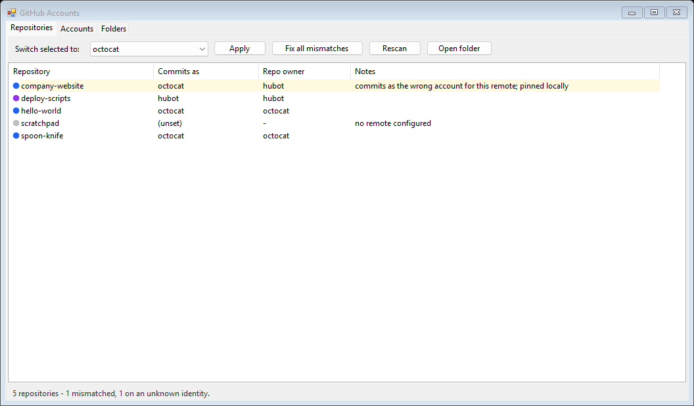
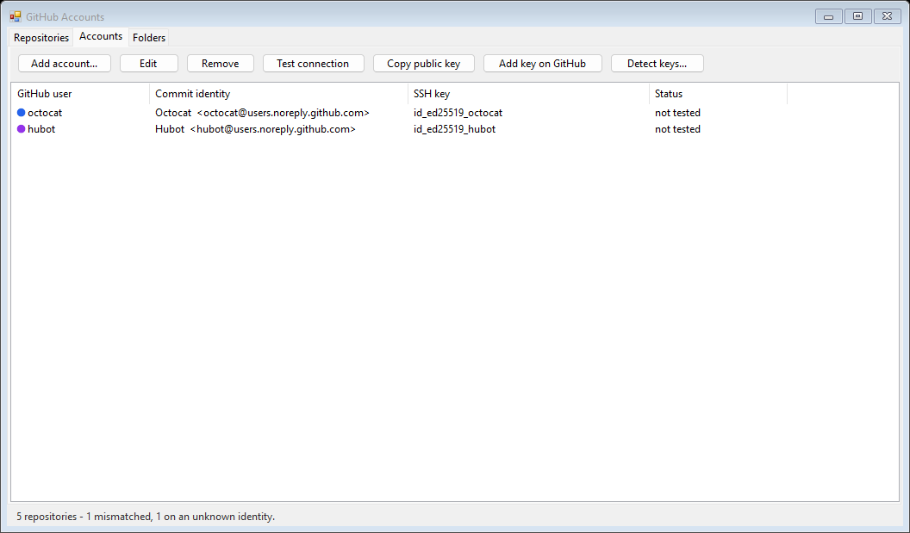
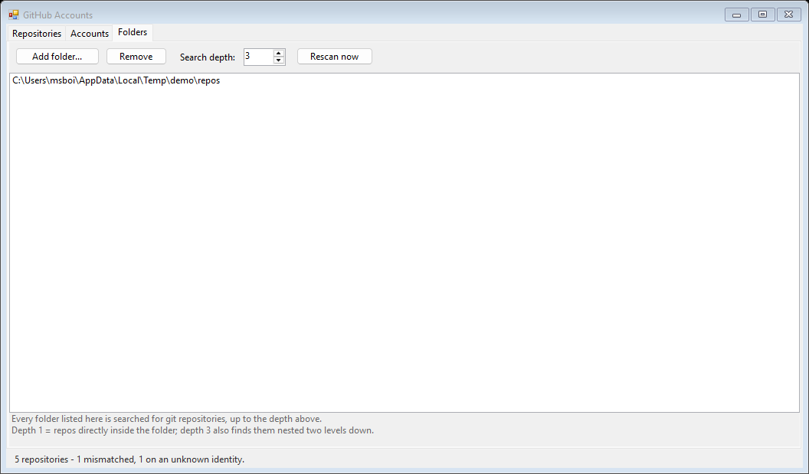

# GitHub Accounts

A small Windows app for people who use **more than one GitHub account** on the
same machine. Every repository automatically commits and pushes as the account
that owns it — no per-repo setup, nothing to remember when you clone.



## The problem

With two accounts, HTTPS doesn't work. Git's credential store keys tokens by
*host*, and both accounts are `github.com`, so whichever you authenticated last
wins. You end up pushing to a work repo as your personal account, or hitting
`403` for no obvious reason — and the wrong author email is baked into commits
before you notice.

The usual fix is SSH host aliases plus `includeIf` in `.gitconfig`. It works,
but it's fiddly to set up, easy to get subtly wrong, and invisible once done.
This app sets it up, keeps it correct, and shows you the current state.

## Install

```cmd
git clone https://github.com/web-dev-nav/multi-git-holder
cd multi-git-holder
install.cmd
```

There is nothing to install first — Windows already ships the compiler this
uses. A prebuilt `GhAccounts.exe` may also be attached to
[Releases](../../releases).

`install.cmd` compiles the app, copies it to `%LOCALAPPDATA%\Programs\GhAccounts`
and adds Desktop and Start Menu shortcuts.

**Requirements:** Windows with .NET Framework 4.x (in-box since Windows 8) and
Git for Windows. No .NET SDK, no runtime installer, no admin rights. The exe is
about 50 KB and starts instantly.

## Quick start

**1. Add your accounts.** *Detect keys...* tries every key in `~/.ssh` against
GitHub and adds the ones that authenticate, naming each from GitHub's own
`Hi <user>!` reply — so a key can't end up filed under the wrong account.
*Add account...* handles a new one, including generating the SSH key, copying
the public half to your clipboard and opening GitHub's "add key" page.



**2. Point it at your code.** Add the folders holding your repositories and set
how deep to search. Common locations are detected on first run.



**3. That's it.** Clone anything — paste a plain `https://github.com/...` URL —
and it is routed to the right key and the right commit identity automatically.

The Repositories tab flags anything inconsistent: a repo committing as the wrong
account for its remote, an identity belonging to neither account, a locally
pinned override. **Fix all mismatches** repairs them in one click.

## How it works

Three standard Git and SSH features, wired together:

| Piece | What it does |
|---|---|
| SSH host aliases | `github-<account>` in `~/.ssh/config`, each bound to one key with `IdentitiesOnly yes` |
| `url.<alias>.insteadOf` | Rewrites any pasted `github.com` URL for that account's org onto its alias, so the right key is used |
| `includeIf "hasconfig:remote.*.url:…"` | Selects `user.name` / `user.email` from the remote URL (Git 2.36+) |

Everything the app writes lives between markers:

```
# >>> gh-account-switcher >>>
...
# <<< gh-account-switcher <<<
```

Only that block is rewritten. Anything else in your `.gitconfig` or
`.ssh/config` — other hosts, other settings — is left untouched.

Configuration is a single JSON file at `%USERPROFILE%\.gh-accounts.json`.

## WSL

Windows and WSL keep separate `~/.ssh` and `~/.gitconfig`, and WSL's ssh rejects
keys stored on `/mnt/c` because they always appear world-readable. To mirror the
setup into WSL:

```bash
bash wsl-sync.sh
```

It copies the keys in with mode `600`, writes the same managed blocks on the
Linux side, and tests each alias.

## Things worth knowing

- **Email privacy.** If an account has *Keep my email private* enabled, pushes
  using a real address are rejected. Use the
  `ID+username@users.noreply.github.com` form from that account's email
  settings. New accounts default to the noreply form for this reason.
- **`core.sshCommand` is cleared.** If it points at some other ssh config, the
  aliases won't resolve and every push fails with
  `Could not resolve hostname github-<account>`. The app removes it and verifies
  with `ssh -G` that each alias resolves before reporting success.
- **`**` in `hasconfig` patterns** degrades to `*` mid-token and cannot cross
  `//`, so the `https://` and `ssh://` forms are written out in full rather than
  prefixed with `**`. A pattern like `**github.com/org/**` silently matches
  nothing.
- **Past commits keep their original author.** This only affects new commits.
  `git commit --amend --reset-author` fixes the most recent one, if it isn't
  pushed yet.
- **Unknown orgs fall back** to your global `user.name` / `user.email` rather
  than guessing.

## Uninstall

```cmd
uninstall.cmd
```

Removes the app and its shortcuts. Your keys, repositories and config are left
alone; delete the marked blocks from `.gitconfig` and `.ssh\config` by hand for
a full revert.

## Building

```cmd
build.cmd
```

Compiles with `csc.exe` from the in-box .NET Framework, so there is nothing to
install. The source targets C# 5 for that compiler — no string interpolation,
no null-conditional operator.

## License

MIT
